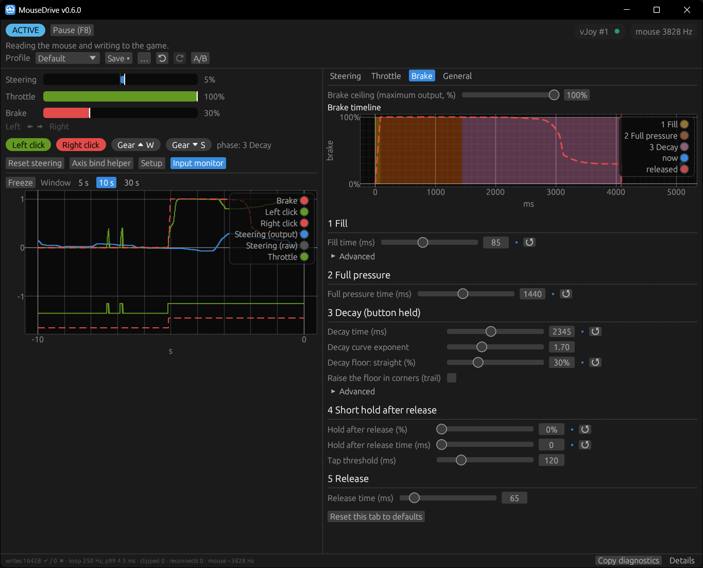

# MouseDrive (Rust) — v0.5.0

[](#requirements)
[](#build)
[](LICENSE)
[](https://app.fossa.com/projects/git%2Bgithub.com%2FToxpox%2FMouseDrive?ref=badge_shield)

MouseDrive is a Windows application that converts mouse and keyboard input into virtual joystick signals via [vJoy](https://github.com/BrunnerInnovation/vJoy), designed for racing simulators.

[Old C++ version](https://github.com/Toxpox/MouseDrive-old-cpp)

<p align="center">
  
</p>

## Download

**[Download latest release](https://github.com/Toxpox/MouseDrive/releases/latest)**

Or browse all versions at [Releases](https://github.com/Toxpox/MouseDrive/releases/).

> Extract the `.zip`, place `vJoyInterface.dll` next to `mousedrive.exe`, and run. Each release also has `mousedrive.exe` on its own; `SHA256SUMS.txt` lists the checksums of both.

## Features

**Driving**

- **Steering** — Mouse X movement mapped to the vJoy X axis with 5 modes: *Linear*, *Expo* (soft centre), *Smoothed* (time constant in ms), *Self-centering* and *Adaptive* (One Euro filter: smooth when slow, no lag when fast). Filters are time-based, so the feel does not change with the loop rate.
- **Lossless mouse counts** — Raw counts are accumulated without rounding or per-event caps; an optional *spike filter* (max steering rate, %/s) limits single-event jumps and counts what it clips.
- **Steering speed in cm** — Shows how many centimetres of mouse travel give full lock; type a distance to set the speed. A built-in *DPI measure* tool finds your mouse DPI with a ruler.
- **Throttle** — Left mouse button with rise/drop times, envelope curves and an optional *throttle cut in corners* summarised as a sentence and a mini chart.
- **Brake** — Right mouse button with a five-phase envelope (fill, full pressure, decay while held, short hold after release, release), an optional trail floor that rises with steering, and a **brake ceiling** (max output %) that scales every phase. A live timeline simulated by the real logic shows what the game will receive.
- **Graphical curve editors** — Drag-point envelope editors (2–8 points, linear or smooth/monotone-cubic) with presets, a live marker, numeric entry and full keyboard control.
- **Gear buttons** — Configurable keys (default W/S) mapped to vJoy buttons 1/2.

**Profiles and tuning workflow**

- **Profiles** — Driving settings per car/track in `profiles\<name>.toml` (shareable; app settings stay in `config.toml`). Save, save as, duplicate, rename, delete; an unsaved-changes dot and a prompt before switching.
- **Undo / redo** (Ctrl+Z / Ctrl+Y), *Revert to saved*, per-setting *reset to default*.
- **A/B comparison** — Keep the current settings as A, edit B, and switch with a hotkey while driving. Profile and A/B switches apply only when both pedals are released.

**Feedback and diagnostics**

- **One clear status** — ACTIVE, PAUSED, SETUP REQUIRED, DEVICE BUSY, CONNECTION LOST, MOUSE NOT READ, DEGRADED or BINDING, each with a sentence and a one-click action. Derived on the control thread, so it is correct even while minimised.
- **Status sounds** — Distinct tones for capture on/off, warnings, connection lost/restored, profile change. Work in exclusive fullscreen and VR.
- **Status overlay** — Optional click-through status label in a screen corner (windowed/borderless games).
- **Input monitor** — Scrolling 5/10/30 s chart of mouse input against the values sent to the game, with capture and profile markers and a freeze button.
- **Setup and health check** — ✔/⚠/✖ list (DLL, driver, version match, device, axes, buttons) with a "how to fix" for every failure, a live axis test and next steps.
- **Axis bind helper** — Countdown, then only the chosen axis or button moves, so the game binds the right one.
- **Automatic reconnect** — Retries when vJoy is fixed or re-plugged; a vJoy removal notice or repeated write failures switch to CONNECTION LOST and it recovers on its own.
- **Stuck-button guard** — If Windows swallows a button release (UAC prompt, Ctrl+Alt+Del), the pedal is released automatically.
- **Diagnostics line** — Write success/failure, measured loop rate and p99, clipped events, reconnects, mouse rate; *Copy diagnostics* puts a bug-report summary on the clipboard.
- **Mouse selection** — Read all mice or only one device ("pick the last moved mouse").

**App**

- **Decoupled control loop** — A dedicated high-priority 250 Hz thread owns vJoy and writes all axes in **one report per tick** (no torn frames); the window can be minimised or stall without affecting the output.
- **Safe config** — Atomic writes (`.tmp` then rename), out-of-range values corrected and reported by name, unreadable files backed up instead of overwritten.
- **Accessibility** — Colour-blind palette (Okabe-Ito), brake always dashed in charts, screen-reader labels on custom widgets, rebindable hotkeys (including mouse side buttons), interface scale 75–200 %.
- **Auto-update** — Background check against GitHub releases with one-click self-update (download → SHA-256 verify → replace → restart).
- **Languages** — Turkish and English.

## Input / Output mapping

| Input | vJoy Output | Control |
|-------|-------------|---------|
| Mouse X movement | X Axis | Steering |
| Left mouse button (held) | Y Axis | Throttle |
| Right mouse button (held) | Rz Axis | Brake |
| Gear up key (default W) | Button 1 | Gear up |
| Gear down key (default S) | Button 2 | Gear down |
| Middle click | — | Reset steering |
| Capture key (default F8) | — | Toggle input capture |
| A/B key (unset by default) | — | Switch between A and B settings |

All keys can be reassigned in **Settings → General → Keys**.

## Quick start

1. Install [vJoy](https://github.com/BrunnerInnovation/vJoy) and enable a device with **X / Y / Rz** axes and **2 buttons** (Device 1 by default).
2. Run [MouseDrive](https://github.com/Toxpox/MouseDrive/releases/latest). If anything is missing, the **Setup** window lists what to fix.
3. Bind the axes in your game with the **Axis bind helper**.
4. Set the game's deadzone to 0, linearity to 1 and filtering off — see [In-game settings](#in-game-settings).

`vJoyInterface.dll` is searched next to the exe, then in `Program Files\vJoy\x64`, then on the standard DLL path. If several copies exist, the one matching the installed driver version is used.

## In-game settings

MouseDrive already shapes the input (steering mode, smoothing, throttle cut, brake envelope). If the game shapes it again, the two stack and the car feels vague, laggy or twitchy — so make the game a straight wire:

| Setting | Value | Why |
|---------|-------|-----|
| Deadzone (steering, throttle, brake) | **0** | MouseDrive has its own deadzone; a second one hides small corrections. |
| Linearity / gamma / sensitivity curve | **1 / linear** | Curves belong in MouseDrive (Expo mode, envelope editors). |
| Filtering / smoothing | **off** | MouseDrive's filters are time-based; a game filter adds lag on top. |
| Speed-sensitive steering | **off** | It reduces steering with speed — mouse steering is already precise. |
| Steering rotation / lock | **as the game recommends for the car** | Full mouse travel maps to the game's full lock; *cm per full lock* tells you how far that is. |
| Axis mapping | **separate axes** | Throttle = vJoy **Y**, brake = vJoy **Rz**; do not use a "combined pedals" axis. |
| Axis direction | **0 = released** | If a pedal reads inverted, toggle the game's *invert* option for that axis. |

- **Binding:** use the **Axis bind helper** (under the live gauges, or in the *Setup* window). Pick the axis, switch to the game during the 5 s countdown and click the binding row; for the next 4 s only that axis (or gear button) moves.
- **Check what the game receives:** *Set up USB game controllers* (`joy.cpl`) → vJoy Device → *Properties* shows the raw axes. If they are right but the car is not, the problem is a game setting.
- Prefer the game's *wheel* input mode over *gamepad* mode: gamepad modes often add their own steering assist and filtering.

## How it works

- **Raw Input thread** — A hidden window receives `WM_INPUT` for mouse counts and buttons (also while the game has focus). Counts are accumulated losslessly; scaling happens later in floating point.
- **Control thread** — A dedicated `THREAD_PRIORITY_HIGHEST` loop (250 Hz by default) owns vJoy. Each tick runs the pure driving logic on a logical clock and writes one complete report. Status, sounds, overlay, telemetry and the stuck-button guard live here too.
- **GUI thread** — eframe/egui reads a snapshot at the start of each frame and publishes config changes with an epoch counter at the end; it never waits for the control thread. Repaint is lazy (~60 Hz focused, ~4 Hz backgrounded).
- **Output backend** — The logic produces a normalised frame; the backend (vJoy today) maps it to its axis range. This keeps a future own driver or USB dongle a drop-in replacement.

## Requirements

- Windows 10/11
- [Executable MouseDrive](https://github.com/Toxpox/MouseDrive/releases/latest)
- [vJoy Driver**](https://github.com/BrunnerInnovation/vJoy) installed and enabled
- `vJoyInterface.dll` available (next to exe, Program Files, or in `PATH`)

>  ** Tested with V2.2.2.0

## Build

```powershell
cargo build --release --manifest-path MouseDrive/Cargo.toml
# without the auto-updater (smaller binary, no network code)
cargo build --release --manifest-path MouseDrive/Cargo.toml --no-default-features
```

Checks run by CI (see `.github/workflows/ci.yml`):

```powershell
cargo fmt --manifest-path MouseDrive/Cargo.toml --check
cargo clippy --manifest-path MouseDrive/Cargo.toml --all-targets --all-features -- -D warnings
cargo clippy --manifest-path MouseDrive/Cargo.toml --all-targets --no-default-features -- -D warnings
```

## Configuration

Settings are stored as TOML in one folder:

1. Next to the exe if a `config.toml` exists there (portable mode)
2. Otherwise `%APPDATA%\MouseDrive\`

| File | Contents |
|------|----------|
| `config.toml` | App settings: language, vJoy device, keys, mouse, sounds, overlay, view, active profile |
| `profiles\<name>.toml` | Driving settings of one profile — copy it to share a setup |
| `mousedrive.log` | Connection and update events (small, never written from the control loop) |

Changes are saved automatically for app settings; profiles are saved with **Save** (Ctrl+S). Files are written atomically. Out-of-range values are corrected on load and reported by name; a file that cannot be read is backed up as `<file>.<timestamp>.bak` and defaults are used. In-game recommendations: [In-game settings](#in-game-settings).

## Project layout

```
MouseDrive/src/
├── main.rs            # Startup/shutdown order, CLI flags, eframe window
├── lib.rs             # Core library (everything except the GUI)
├── logic.rs, logic/   # Pure driving logic (steering, throttle, brake) + filters
├── curve.rs           # Envelope curve model (PCHIP eval/inverse, presets)
├── control/           # Control thread: engine (tick), connection/reconnect, stuck-button guard, IO seam
├── output.rs          # OutputBackend trait + normalised OutputFrame
├── vjoy.rs            # vJoy backend (runtime DLL loading, single-report writes, removal callback)
├── input.rs           # Raw Input thread: lossless counts, buttons, mouse selection
├── keys.rs            # Hotkey helpers (GetAsyncKeyState)
├── config.rs          # Config + Tuning, validation, migration, atomic IO
├── profiles.rs        # Profile files
├── session.rs         # GUI editing session: epochs, undo history, save state
├── status.rs          # Status model and sound cue planning
├── setup.rs           # Setup/health check report
├── telemetry.rs       # Lock-free ring buffer for the input monitor
├── diagnostics.rs     # Loop timing, mouse rate, bug-report text
├── preview.rs         # Offline simulation for the brake timeline and throttle chart
├── bind.rs            # Axis bind helper
├── ergonomics.rs      # cm per full lock
├── sound.rs, overlay.rs, platform.rs, fsutil.rs, log.rs, update.rs
├── curve_editor.rs    # Drag-point curve editor widget
├── lang/              # TR / EN strings
└── ui/                # egui screens: status bar, dashboard, tabs, profiles, monitor, setup, ...
```

Release history in [CHANGELOG.md](CHANGELOG.md).

## Troubleshooting

Start with the **Setup** window: it checks every requirement and says how to fix each failure. **Copy diagnostics** (bottom line) gives a summary to paste into a bug report.

| Problem | Solution |
|---------|----------|
| "vJoyInterface.dll not found" | Install vJoy, or place the DLL next to the exe or in `Program Files\vJoy\x64` |
| DLL and driver versions differ | Remove old `vJoyInterface.dll` copies next to the exe, or reinstall vJoy |
| "vJoy not enabled" | Check that the vJoy driver is installed and enabled (vJoyConf) |
| DEVICE BUSY | Another feeder (Joystick Gremlin, SimHub, UCR…) owns the device — close it or choose another vJoy device in **General → Output** |
| CONNECTION LOST | MouseDrive retries every second on its own; after 15 s the status becomes SETUP REQUIRED and it keeps retrying every 2 s. **Reconnect** forces a retry |
| MOUSE NOT READ | Turn on **Read mouse while the game has focus** in **General → Mouse** |
| PAUSED | Press the capture key (default **F8**) |
| The game binds the wrong axis | Use the **Axis bind helper** |
| Steering feels laggy or has a deadzone | Set the game's deadzone to 0, linearity to 1, filtering off — [in-game settings](#in-game-settings) |
| **Brake or throttle stays pressed after MouseDrive crashed or was killed** | vJoy keeps the last values when the feeding process dies (measured with vJoy 2.2.2.0). Start MouseDrive again: it writes neutral values as soon as it takes the device. A normal exit always leaves neutral values. |
| A pedal stayed pressed after a UAC prompt | The stuck-button guard releases it within ~200 ms; the count appears in diagnostics |
| Settings not saving | Check write permissions in `%APPDATA%\MouseDrive\` (or the exe folder in portable mode) |

## License

Copyright (c) 2025-2026 [Toxpox](https://github.com/Toxpox).
MouseDrive is free software: you can redistribute it and/or modify it under the terms of the [GNU General Public License](https://github.com/Toxpox/MouseDrive/blob/main/LICENSE) as published by the Free Software Foundation, either version 3 of the License, or (at your option) any later version.

Releases up to v0.5.0 were published under the MIT License and remain available under it.

The license grants no rights to the MouseDrive name or logo (GPL-3.0 section 7(e)). Modified versions must not be presented as the original MouseDrive (section 7(c)).

[](https://app.fossa.com/projects/git%2Bgithub.com%2FToxpox%2FMouseDrive?ref=badge_large)
